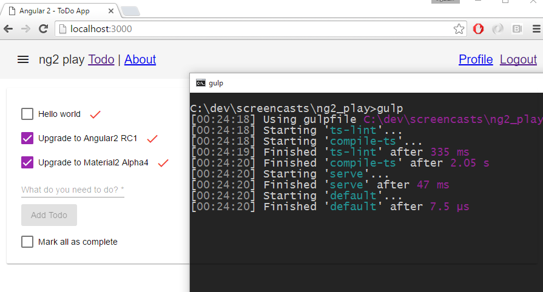

## Angular 2 Play

This repo uses Angular 2 RC3 with Material 2 Alpha 6 and the new 3.0 Router.

Run the following commands to run the application

    npm install    
    gulp

# Screencasts

## 2016-07-05 Upgrading to 3.0 Router and Guarding Routes

- https://youtu.be/w1PFJT_FfSY

## 2016-04-14 Replacing Bootstrap with Material2

- https://youtu.be/9w7NLvJTCcU

## 2016-03-20 Angular2 Material First Look

- https://youtu.be/ngkVXUCBozc

## 2016-03-13 Lifecycle Hooks 

- https://youtu.be/bY92HFyaBvo

## 2016-02-07 Auth and JWT Tokens with ExpressJS 

- https://youtu.be/fDHihQ5hB5I

## 2016-01-23 Auth0 in 10 minutes (signup/login/logout) 

- https://youtu.be/n4gSXwVDkSw

## 2015-12-27 Upgrade from alpha37 to beta0

- https://youtu.be/1xHMaCzEoUI

## 2015-09-11 Build automation with Gulp

- https://youtu.be/7xOubdqyqaY

## 2015-09-03 Routing — Everything you need to know in 13 minutes

- https://youtu.be/ZsGRiHSaOxM

## 2015-08-14 Forms - Extended app with validation

- http://www.towfeek.se/2015/08/angularjs-2-0-forms-validation/
- https://youtu.be/267ClmzfzvI

## 2015-07-07 First look - Created Todo App

- http://www.towfeek.se/2015/07/angularjs-2-overview/
- https://youtu.be/rd3cLh_wn04